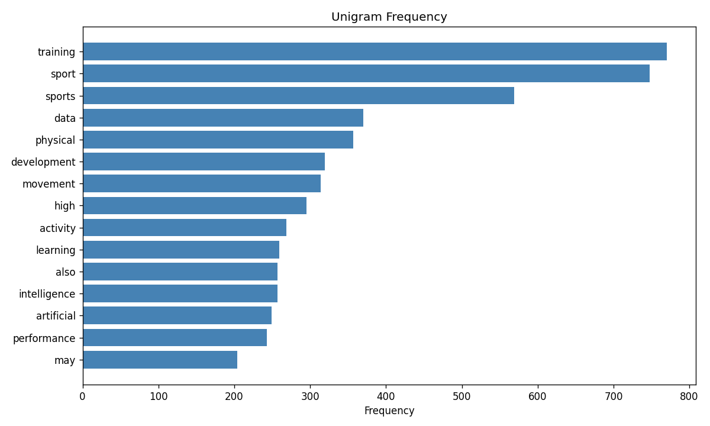
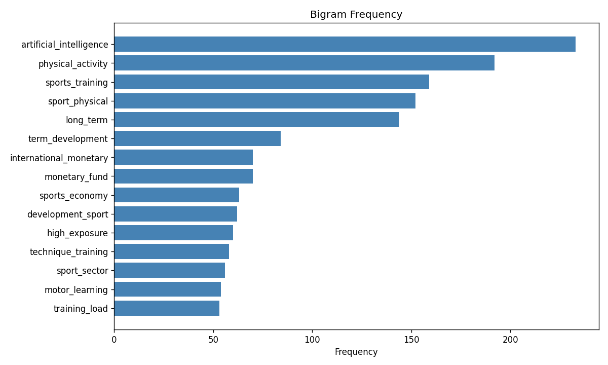
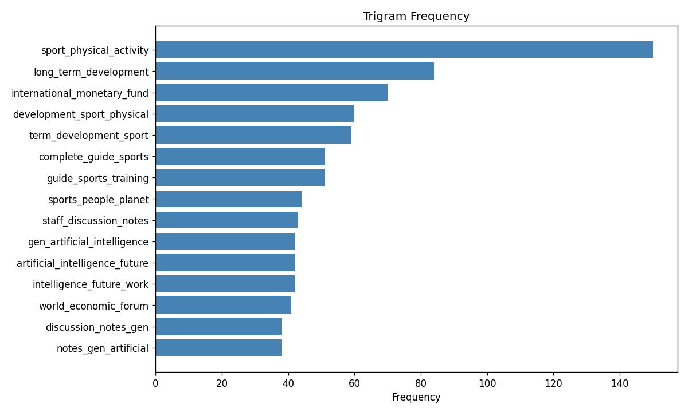
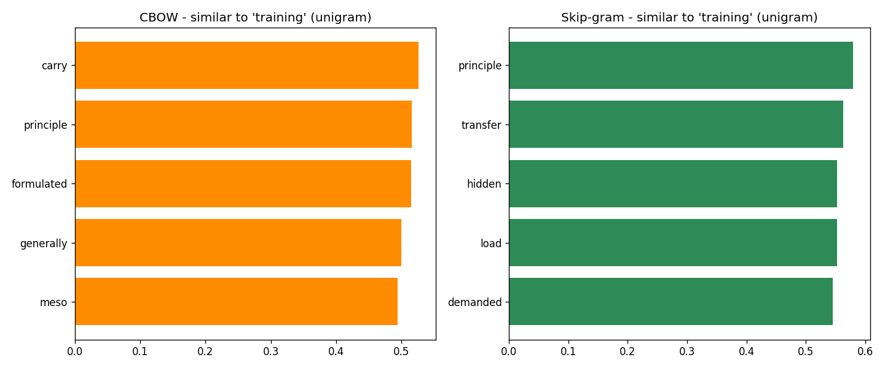
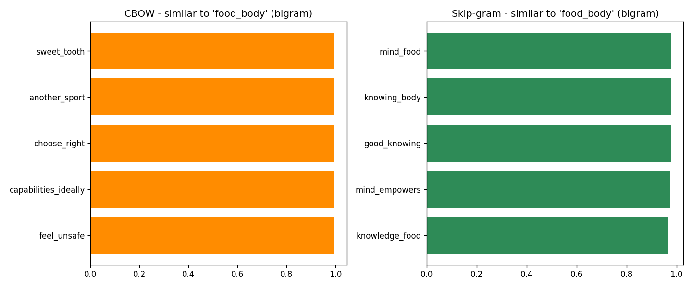
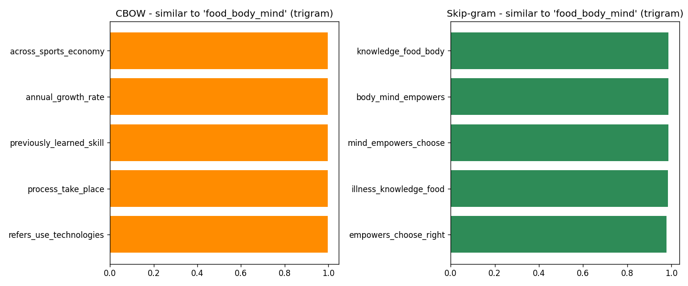
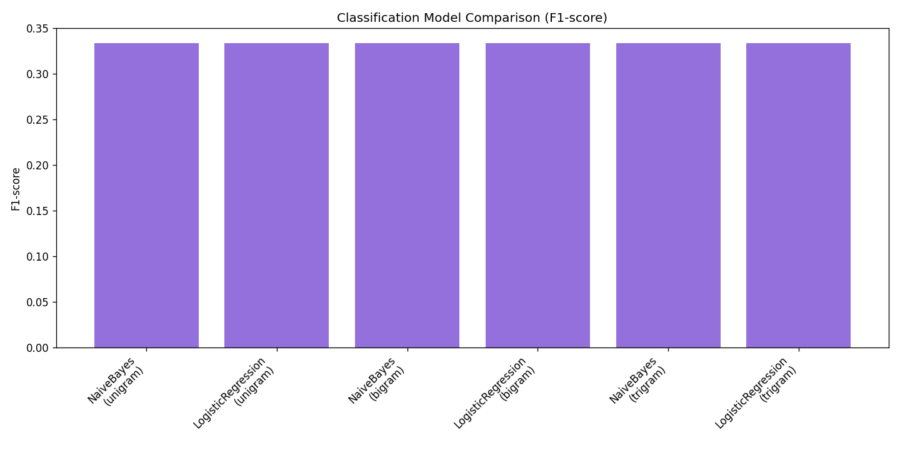
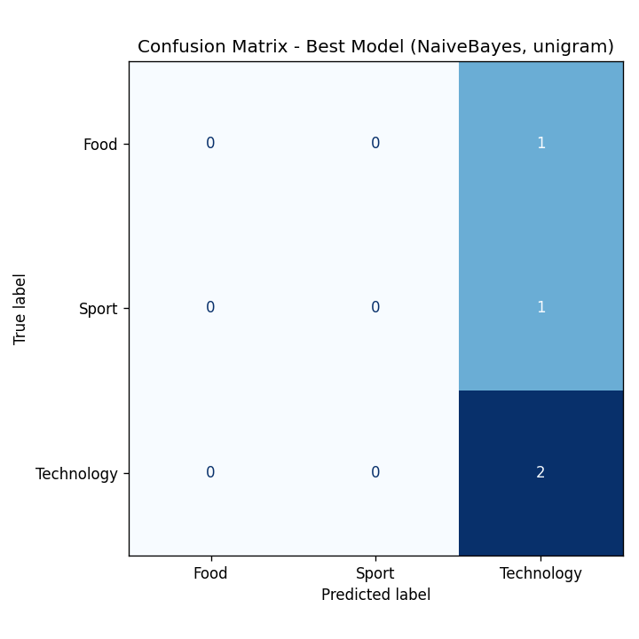
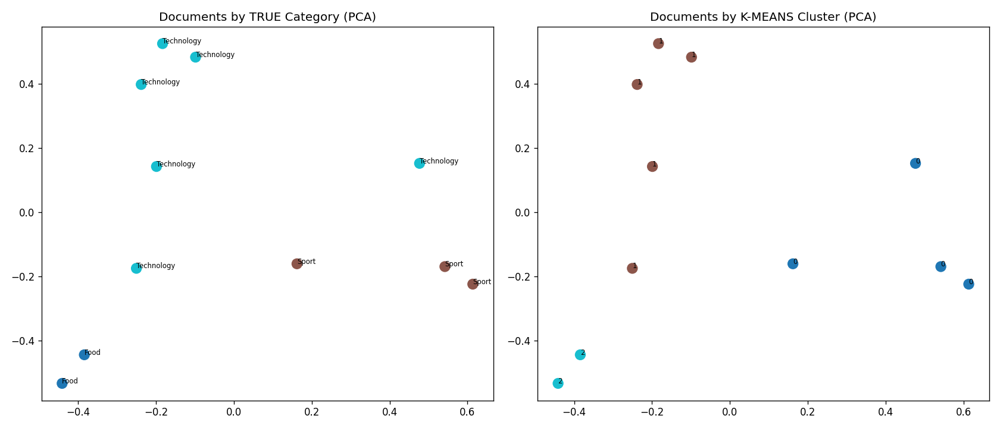

# PDF-NLP-Pipeline

A complete NLP pipeline built on a self-collected PDF corpus, covering text extraction, cleaning, n-gram analysis, next word prediction using Word2Vec (CBOW and Skip-gram), and text classification using Naive Bayes, Logistic Regression, and K-means clustering.

📄 [View Full Assignment Report (PDF)](Full%20Report.pdf)

**Author:** Sikender Gillani | BSAI-23F-0062

---

## Overview

This project processes a category-wise PDF corpus (Technology, Sport, Food) through a full NLP pipeline:

1. Extracts raw text from PDFs
2. Cleans and preprocesses the text using regular expressions
3. Generates unigram, bigram, and trigram representations
4. Trains CBOW and Skip-gram Word2Vec models for next word prediction
5. Trains Naive Bayes and Logistic Regression classifiers
6. Applies K-means clustering and compares it against true category labels
7. Produces evaluation metrics and visualizations for every step

---

## Project Structure
PDF-NLP-Pipeline/
Food/                        PDF files for the Food category
Sport/                       PDF files for the Sport category
Technology/                  PDF files for the Technology category
step1_extract.py             PDF text extraction and CSV creation
step2_clean.py                Text cleaning and preprocessing
step3_ngrams.py               N-gram generation and frequency graphs
step4_word2vec.py             CBOW and Skip-gram training and comparison
step5_classification.py       Naive Bayes, Logistic Regression, K-means
requirements.txt
Full Report.pdf
README.md

---

## How to Run

Install dependencies:
pip install -r requirements.txt

Run each step in order:
python step1_extract.py
python step2_clean.py
python step3_ngrams.py
python step4_word2vec.py
python step5_classification.py

Each script saves its own CSV output and graphs into the project folder.

---

## Pipeline Details

### Step 1: PDF Text Extraction
Reads every PDF from the category folders using PyMuPDF and builds a structured CSV containing file name, category, and raw extracted text.

### Step 2: Text Cleaning
Applies lowercase conversion, URL removal, email removal, number removal, punctuation removal, extra space normalization, stopword removal, tokenization, and removal of very short tokens.

### Step 3: N-grams and Frequency Graphs
Builds unigram, bigram, and trigram versions of the cleaned corpus and generates frequency graphs for each.

### Step 4: Next Word Prediction with Word2Vec
Trains CBOW and Skip-gram models on the unigram, bigram, and trigram corpora, and compares their predictions for shared test words.

### Step 5: Text Classification
Trains Naive Bayes and Logistic Regression on TF-IDF features across all three n-gram levels, evaluates using accuracy, precision, recall, and F1 score, plots the confusion matrix for the best performing model, and applies K-means clustering with a PCA visualization comparing clusters against the true category labels.

---

---

## Graphs and Visualizations

### Top Word Frequency

### Unigram Frequency

### Bigram Frequency

### Trigram Frequency

### CBOW vs Skip-gram Comparison, Unigram

### CBOW vs Skip-gram Comparison, Bigram

### CBOW vs Skip-gram Comparison, Trigram

### Classification Model Comparison

### Confusion Matrix, Best Model

### K-means Clustering, PCA Visualization

## Results Summary

- The corpus contained 11 usable documents across 3 categories after cleaning, with one PDF skipped due to being a scanned image with no extractable text
- Skip-gram consistently produced more topically coherent word predictions than CBOW across all n-gram levels
- Classification models achieved limited accuracy due to the small dataset size, all combinations converged to majority class prediction
- K-means clustering achieved an Adjusted Rand Index of 0.670 against the true category labels, outperforming the supervised classifiers on this small dataset

## Limitations

The corpus used here is very small, 11 documents across 3 unbalanced categories. This limits the reliability of the classification results and should be considered when interpreting the metrics. The methodology and code are built to scale correctly with a larger, more balanced corpus.
